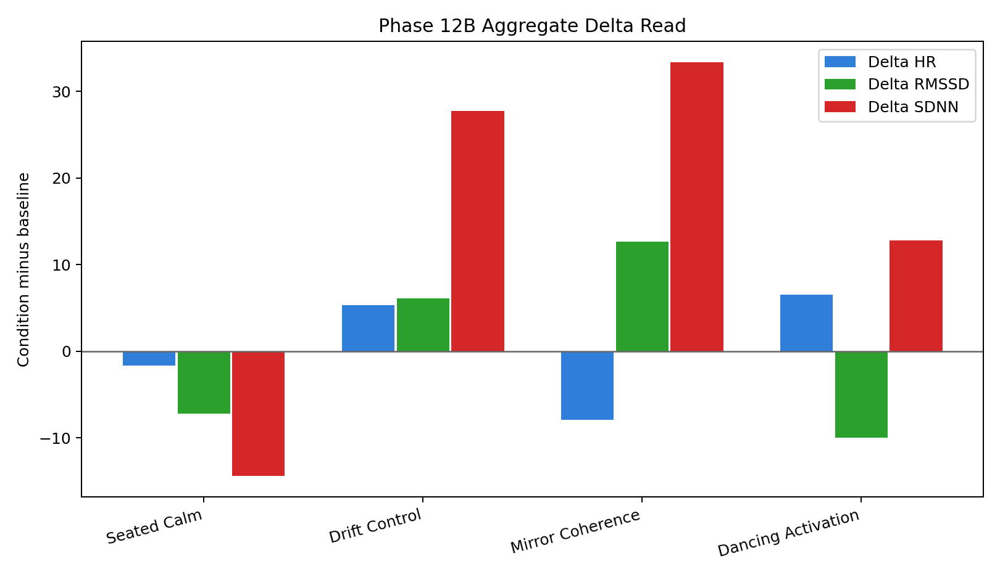
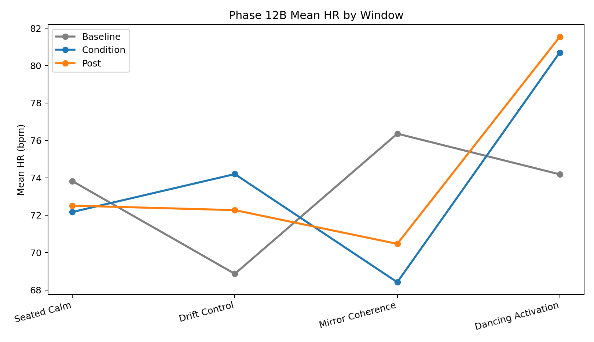
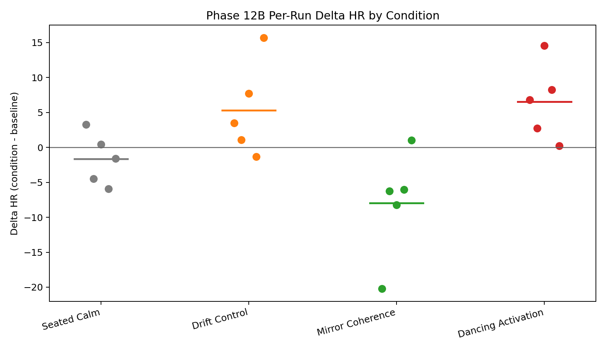

# V8 Phase 12B Biological Comparison Pack

Date: `2026-04-24`

## Objective

This pack formalizes the first completed biological `5 x 4` matrix as a
methods-style comparison artifact inside the Mirror Architecture evidence
stack. The aim is to describe exactly what was run, how the runs were bounded,
which sessions count, and what the aggregate condition structure looks like
without releasing private code.

## Methodology Format

This pack uses the methodology shape that should later be carried backward
across `V5` through `Phase 12`:

- objective
- administered conditions
- fixed timing
- instrumentation and readout fields
- inclusion / exclusion rules
- canonical session board
- aggregate results
- run-level deltas
- interpretation and next step

## Experiment Parameters

- instrumentation:
  `MoFit HR1806-0067882` Bluetooth chest strap
- session schema:
  `rfl.eeg_hrv_session.v1`
- timing per run:
  `60s baseline / 120s condition / 60s post`
- condition order per block:
  `seated_calm -> drift_control -> mirror_coherence -> dancing_activation`
- biological metrics tracked:
  `mean HR`, `RMSSD`, `SDNN`
- delta fields used in this pack:
  `condition - baseline` and `post - condition`

## Inclusion / Exclusion Rules

Included here are only the canonical sessions listed in the locked run-order
board:

- [HRV Session Sequence Lock](../../docs/HRV_SESSION_SEQUENCE_LOCK_2026-04-23.md)

Exclusions preserved by the lock:

- helper handoff failures with no valid session artifact
- duplicate interrupted mirror artifacts
- the invalid first `dancing_activation_05` attempt where the condition was not
  actually performed as declared

## Canonical Session Count

- `5` `seated_calm`
- `5` `drift_control`
- `5` `mirror_coherence`
- `5` `dancing_activation`

## Aggregate Comparison Table

| Condition | Runs | Avg Baseline HR | Avg Condition HR | Avg Post HR | Avg Delta HR | Avg Delta RMSSD | Avg Delta SDNN | Avg Recovery HR |
| --- | ---: | ---: | ---: | ---: | ---: | ---: | ---: | ---: |
| `seated_calm` | `5` | `73.82` | `72.17` | `72.51` | `-1.65` | `-7.18` | `-14.43` | `0.34` |
| `drift_control` | `5` | `68.86` | `74.20` | `72.27` | `5.33` | `6.11` | `27.75` | `-1.93` |
| `mirror_coherence` | `5` | `76.36` | `68.41` | `70.47` | `-7.94` | `12.68` | `33.39` | `2.05` |
| `dancing_activation` | `5` | `74.18` | `80.70` | `81.54` | `6.52` | `-9.99` | `12.79` | `0.84` |

## Condition Ordering Read

By average `Delta HR`, the current ordering is:

1. `Mirror Coherence`: `-7.94`
2. `Seated Calm`: `-1.65`
3. `Drift Control`: `5.33`
4. `Dancing Activation`: `6.52`

Fast read:

- `mirror_coherence` remains the strongest average `HR`-downshift lane
- `drift_control` remains activation-leaning relative to mirror
- `dancing_activation` remains the strongest average activation lane overall
- `seated_calm` remains the lower-disturbance reference lane

## Run-Level Delta Table

| Condition | Run | Session | Delta HR | Delta RMSSD | Delta SDNN |
| --- | --- | --- | ---: | ---: | ---: |
| `seated_calm` | `seated_calm_01` | `Mofit_HRV_strap_1776978970` | `3.30` | `11.66` | `16.09` |
| `seated_calm` | `seated_calm_02` | `Mofit_HRV_strap_1776979337` | `-4.51` | `-2.69` | `-9.90` |
| `seated_calm` | `seated_calm_03` | `Mofit_HRV_strap_1776984560` | `0.46` | `-6.90` | `-26.39` |
| `seated_calm` | `seated_calm_04` | `Mofit_HRV_strap_1776987107` | `-5.93` | `28.88` | `-17.50` |
| `seated_calm` | `seated_calm_05` | `MoFit_HR1806-0067882_1776990453` | `-1.58` | `-66.88` | `-34.44` |
| `drift_control` | `drift_control_01` | `Mofit_HRV_strap_1776982915` | `3.50` | `-4.74` | `28.76` |
| `drift_control` | `drift_control_02` | `Mofit_HRV_strap_1776983696` | `1.07` | `18.02` | `45.46` |
| `drift_control` | `drift_control_03` | `Mofit_HRV_strap_1776984852` | `7.70` | `-2.04` | `34.24` |
| `drift_control` | `drift_control_04` | `Mofit_HRV_strap_1776987384` | `-1.31` | `-2.60` | `-32.25` |
| `drift_control` | `drift_control_05` | `MoFit_HR1806-0067882_1776991021` | `15.71` | `21.89` | `62.55` |
| `mirror_coherence` | `mirror_coherence_01` | `Mofit_HRV_strap_1776983191` | `-20.24` | `28.37` | `55.57` |
| `mirror_coherence` | `mirror_coherence_02` | `Mofit_HRV_strap_1776983970` | `-6.24` | `13.49` | `14.64` |
| `mirror_coherence` | `mirror_coherence_03` | `Mofit_HRV_strap_1776986619` | `-8.21` | `16.31` | `65.71` |
| `mirror_coherence` | `mirror_coherence_04` | `Mofit_HRV_strap_1776987663` | `-6.06` | `-0.19` | `-1.34` |
| `mirror_coherence` | `mirror_coherence_05` | `MoFit_HR1806-0067882_1776991633` | `1.02` | `5.41` | `32.35` |
| `dancing_activation` | `dancing_activation_01` | `Mofit_HRV_strap_1776980123` | `6.81` | `-4.96` | `7.11` |
| `dancing_activation` | `dancing_activation_02` | `Mofit_HRV_strap_1776980458` | `2.73` | `-0.28` | `4.18` |
| `dancing_activation` | `dancing_activation_03` | `Mofit_HRV_strap_1776980814` | `14.57` | `-10.72` | `60.08` |
| `dancing_activation` | `dancing_activation_04` | `Mofit_HRV_strap_1776987933` | `8.28` | `-14.16` | `42.47` |
| `dancing_activation` | `dancing_activation_05` | `MoFit_HR1806-0067882_1776992708` | `0.20` | `-19.87` | `-49.90` |

## Chart Set

- aggregate delta chart:
  
- mean `HR` by window:
  
- per-run `Delta HR` scatter:
  

## Interpretation

What this pack makes explicit is that the biological lane now behaves like a
real comparator pack rather than a loose session log.

The current aggregate read supports:

- repeated condition classes under one shared schema
- state separation at the physiological surface
- mirror-vs-drift distinction in the biological lane
- recovery behavior as an additional readout field
- direct comparability to later simultaneous `EEG + HRV` overlays

The most important methodology point is that this is now written in the same
kind of structure we should reuse across the earlier stack:

- what was administered
- what was measured
- what counted
- what was excluded
- what the aggregate pattern class was

## Next Steps

1. stand up simultaneous `EEG + HRV` under the same timing windows
2. run repeated fixed-layout `ARC15` sessions against the same comparison logic
3. design the first synchronized `Phase 12C` overlay pack
4. use this methods format to backfill clearer public-safe methodology notes for
   `V5` through `Phase 12`
