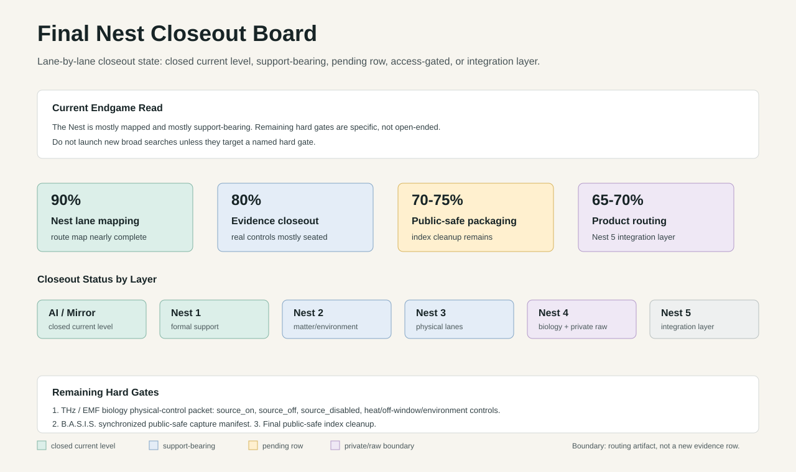

# Final Nest Closeout Board

Date: `2026-07-14`

Status: `working_closeout_board / no_toy_data / public_safe_boundary`

Visual:



## Purpose

This board converts the Nest map from an open-ended lane chase into a closeout
surface.

The goal is not to run every possible dataset. The goal is to know, lane by
lane, whether the current support level is:

- `closed_current_level`: real source, state/control, scoring, and controls are
  complete enough for the current support claim; future work is optional
  strengthening.
- `support_bearing`: real support exists, but a named caveat or stronger
  control remains.
- `pending_row`: the required protocol or source path is defined, but real rows
  are not yet present.
- `access_gated`: the right source is identified, but access/permission blocks
  scoring.
- `private_raw_boundary`: private/local captures exist, but public-safe release
  or synchronized scoring remains gated.
- `optional_extension`: not required for current architecture closeout, but
  valuable for deeper product/IP expansion.

Plain English: stop chasing infinite proof. Keep the claim matched to the
strongest real evidence, name the boundary, and move only the rows that truly
need the next gate.

## Global End Condition

The Nest is considered closeout-ready for architecture support when each active
lane has:

```text
source -> state/control -> transform -> score -> collapse/null control -> boundary -> next gate
```

Current read:

```text
The Nest is mostly mapped and mostly support-bearing.
The remaining hard evidence gap is not the whole Nest.
It is the THz/EMF biology physical-control packet plus B.A.S.I.S. live synchronized public-safe capture packaging.
The recorded B.A.S.I.S. Holoscan runtime bridge is now seated as support-bearing.
```

## Closeout Summary

| Area | Current state | Closeout read |
| --- | --- | --- |
| `AI / transformer / mirror architecture` | `closed_current_level` | V7/V8, bridge rows, attention/MLP/SAE support, and patent spine support the architecture side. Nemotron remains a platform expansion row. |
| `Nest 1 formal / mathematical substrate` | `closed_current_level_with_named_extensions` | Broad formal lane inventory is support-bearing; remaining extensions are specific pathway/attention/graph or deeper topology gates, not a blank map. |
| `Nest 2 structured matter / electrochemistry / environment` | `support_bearing_to_closed_current_level` | Water, redox, oxygen, ozone, smoke/PM2.5, EIS, Li conductivity, and material/environment rows are public-safe support-bearing. |
| `Nest 3 field / physical coherence` | `mostly_closed_current_level` | Most physical lanes now have support reads. THz/EMF biology remains the main pending-row gate. |
| `Nest 4 biology / biomolecular / physiology` | `support_bearing_with_private_raw_boundary` | Cells/genome, metabolism, food/nutrients, ChEBI, lipids, glycans are public-safe support-bearing. HRV + Muse and recorded B.A.S.I.S. Holoscan routing are support-bearing. Live synchronized manifest and Thermo triple remain gated. |
| `Nest 5 convergence / product / IP routing` | `integration_layer_with_runtime_bridge` | Not a raw-data lane. It receives supported rows and converts them into product, claim, licensing, Golden Field Lite / Mirror Index surfaces, and now a B.A.S.I.S. runtime-routing bridge. |

## Nest 3 Field / Physical Closeout Board

| Lane | Status | Best evidence | Boundary | Next action |
| --- | --- | --- | --- | --- |
| `Waves / Spectra / Phase-Lock` | `support_bearing` | ASTER-style spectra, Ramdb Raman, NIST gas IR, NIST THz, cross-spectral and same-family panels, repeated THz-TDS source/reference support | Pure phase-lock remains too strong until raw phase/source controls close. THz biology shared-feature transfer is weak/mixed. | Keep as support-bearing; only extend if a raw phase/instrument source-on/off dataset appears. |
| `Terahertz material spectra` | `support_bearing` | `NEST3_TERAHERTZ_NIST_MATERIAL_FAMILY_SUPPORT_READ_2026-05-27.md`; same-family and repeated-scan THz-TDS reads | Broad material classification and cross-material source/reference transfer are mixed; matched repeated-scan source/reference is stronger. | No more broad THz search unless it brings missing controls. |
| `THz / EMF biology` | `pending_row` | Public GEO THz rows, GSE246029 source-on/source-off support, harmonized THz biology manifest, GSE57135 adjacent EMF/MMW heat-control bridge | Full source-disabled, heat-matched, off-window, distance, power, duration, temperature, and environmental controls are not present in public THz rows. | Use `NEST3_THZ_EMF_LOCAL_CAPTURE_PROTOCOL_2026-07-14.md` or partner packet; score real source_on/source_off/source_disabled rows. |
| `Fire + Plasma` | `closed_current_level` | RD-PCI nanosecond pulsed-discharge OES source gate | First source gate, not total plasma atlas. | Optional extension only: second plasma/combustion source family. |
| `EMF / Fields` | `support_bearing` | RD-PCI VI pulse-coupled field waveform-state support | Time-order/source-state caveat; local source-disabled controls remain better for hard closeout. | Tie to THz/EMF capture packet instead of launching a separate open search. |
| `Oscillators / Resonance` | `closed_current_level` | NIST Luther, Silverbox, FASER, and FrID measured frequency-response gates | Strong current chain; not every oscillator class. | Optional extension only: local instrumented oscillator rows. |
| `Fusion + Solar` | `closed_current_level` | NASA OMNIWeb hardening rerun: `17,544` hourly rows, `1,133` windows, event-block AUC `0.998851`, feature-shuffle AUC `0.501022` | Window-statistic support, not raw phase-order or full solar-cycle proof. | Optional extension: longer solar-cycle span or NASA POWER solar-radiation comparator. |
| `Gases / Liquids / Phases` | `closed_current_level` | NIST isobaric/supercritical hardening rerun: `931` records, species-pressure AUC `0.996067`, feature-shuffle AUC `0.485563` | Pressure-temperature boundary is expected and visible; no complete thermodynamic atlas claim. | Optional extension: isochoric/two-phase dome rows or second thermodynamic source family. |
| `Gravity / Orbits` | `support_bearing` | NASA Exoplanet Archive adjacent-orbit support row | First-pass orbit architecture, not full ephemeris propagation or dynamical resonance closeout. | Optional extension: public ephemeris/orbit propagation dataset with random-pair nulls. |
| `Space / Time / Cycles` | `support_bearing_via_adjacent_lanes` | Fusion/Solar event windows, Gravity/Orbits, oscillator/time-series gates | Not yet a standalone named cycle dataset. | Optional extension: explicit public cycle dataset if needed for presentation symmetry. |

## Nest 4 Biology / Biomolecular Closeout Board

| Lane | Status | Best evidence | Boundary | Next action |
| --- | --- | --- | --- | --- |
| `Cells + Genome` | `support_bearing` | WDBC cell nuclei morphology support: AUC `0.995106`; shuffled/feature controls collapse | Morphology proxy, not transcriptome/pathway perturbation closeout. | Optional extension: transcriptome, pathway, or perturbation dataset. |
| `Metabolism` | `support_bearing` | Diabetes clinical/metabolic support: AUC `0.962846`; controls collapse | Small clinical proxy, not direct metabolomics. | Optional extension: real metabolomics or HRV/Muse paired physiology response. |
| `Food / Nutrient Composition` | `support_bearing` | USDA/FoodData nutrient-vector support: AUC `0.988659`; controls collapse | Nutrient-composition bridge, not diet recommendation or physiology response. | Optional extension: FooDB/HMDB/FoodData expansion plus paired physiology windows. |
| `ChEBI biomolecular ontology` | `closed_current_level` | Amino/fatty acid and nucleotide/carbohydrate ChEBI closure; AUCs `0.993090` and `0.999957` | Ontology/property support, not measured wet-lab response. | Optional extension only. |
| `LIPID MAPS lipid core` | `closed_current_level` | LMSD binary and multiclass lipid-core confirmation | Structure/source classification, not lipidomics response. | Optional extension only. |
| `GlyTouCan / GlyCosmos glycans` | `support_bearing` | Human vs mouse glycan sequence/source rows, AUC `0.739219`; controls collapse | Moderate support, not clinical glycomics. | Optional extension: larger glycan panels or paired metabolomics. |
| `HMDB` | `access_gated` | Official access/download gate verified; Cloudflare/download permission issue blocks scoring | No HMDB support score run. | Clear permission/download path or use alternate open metabolomics source. |
| `B.A.S.I.S. HRV + Muse` | `support_bearing_private_raw_boundary` | Same-clock HRV/Muse bridge and private capture manifest; public-safe summaries exist | Raw biometric/device captures remain private; EEG waveform QA and masks still matter. | Build synchronized public-safe manifest with HRV + Muse + packet QA; keep raw exports private until cleared. |
| `B.A.S.I.S. Holoscan runtime bridge` | `support_bearing_recorded_runtime_bridge` | Recorded B.A.S.I.S. state frames: `468` input/source/guard/sink rows, `7` lane sink files, `0` drops, `0` sequence gaps; multi-segment gate preserves `2` recorded windows with `0` global and segment gaps | Recorded runtime bridge, not live clinical deployment or medical-device approval. | Next gate is live or freshly recorded B.A.S.I.S. rows -> Holoscan source adapter -> timing/quality guard -> lane sink receipt -> synchronized public-safe manifest. |
| `B.A.S.I.S. Thermo / Withings sidecars` | `pending_row` | Thermo troubleshooting and display/API artifacts exist as sidecar progress | Not yet repeatable enough for support-bearing paired evidence. | Keep as product troubleshooting lane; do not make it core proof. |

## Nest 5 Convergence / Product Closeout Board

| Surface | Status | Role | Boundary | Next action |
| --- | --- | --- | --- | --- |
| `Golden Field Lite / AI Expert partner` | `integration_layer` | Converts supported evidence rows into long-context evidence memory, domain tools, and tuned partner surfaces | Not a standalone proof row. | Use only support-bearing lanes as sources. |
| `Mirror Index / visual RAG` | `optional_extension` | Retrieval and evidence-routing surface for supported rows | Concept/product layer until implemented against public-safe docs. | Build after final public-safe index cleanup. |
| `B.A.S.I.S.` | `active_product_lane_with_runtime_bridge` | Applied biosignal lane: HRV/Muse/Thermo/MoFit/medical workflow integration plus recorded Holoscan source / guard / sink routing | Product lane has live captures but public proof must stay bounded. Recorded runtime routing is support-bearing; live deployment remains gated. | Prioritize synchronized manifest, live-ingest bridge, and NVIDIA stack mapping. |
| `YRA Core / Sovereign Edge` | `productization_layer` | Hardware deployment surface for local-first Mirror Architecture / Golden Field Lite | Not evidence by itself. | Use as deployment packaging, not proof language. |
| `Quantum / frontier math / hard-problem surfaces` | `continuation_lane` | Investor/research expansion surface tied to existing formal and physical rows | Keep separate from current Nest proof closeout unless a real source gate is run. | Route into campaign docs, not core proof inflation. |

## Remaining Hard Gates

Only these are still core closeout blockers:

1. `THz / EMF biology physical-control packet`
   - Needs real source_on/source_off/source_disabled rows.
   - Preferred controls: sham, heat_matched, off_window, distance, power,
     duration, temperature, humidity, and checksums.
   - Current files:
     `experiments/nest3_thz_emf_source_on_off_gate/NEST3_THZ_EMF_LOCAL_CAPTURE_PROTOCOL_2026-07-14.md`
     and
     `experiments/nest3_thz_emf_source_on_off_gate/NEST3_THZ_EMF_PARTNER_READY_PACKET_2026-07-14.md`.

2. `B.A.S.I.S. live synchronized public-safe capture manifest`
   - Needs HRV + Muse packet continuity, waveform EEG QA, IMU/DRL masks, and
     public-safe artifact summary.
   - Recorded Holoscan runtime bridge is seated; live or freshly recorded
     source adapter -> guard -> sink receipt remains the next stronger gate.
   - Thermo remains sidecar until repeatable.

3. `Final public-safe index cleanup`
   - Link every current closeout doc.
   - Keep raw data/private captures out.
   - Mark optional extensions cleanly.

## Current Percent Read

| Workstream | Current estimate |
| --- | ---: |
| Nest lane mapping | `90%` |
| Evidence/control closeout | `80%` |
| Public-safe packaging | `80%` |
| Product/Nest 5 routing | `75%` |

## Final Instruction

Do not launch new broad searches unless they target a named hard gate.

Default next move:

```text
THz/EMF packet waits for real rows.
Meanwhile, finish final public-safe index cleanup, B.A.S.I.S. synchronized manifest,
and live-ingest Holoscan bridge.
```
