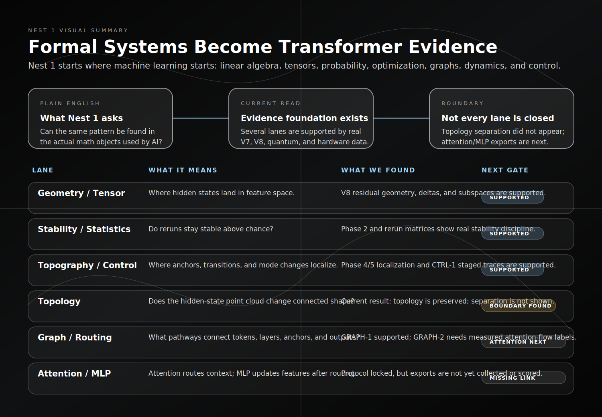
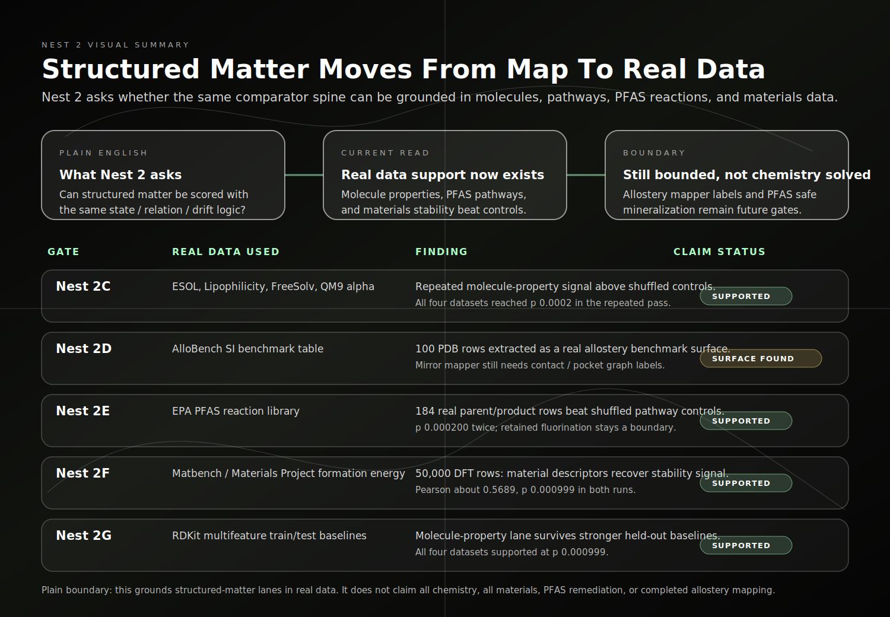

# Nest 1 And Nest 2 Visual Explainer

Date: `2026-04-28`

Status: `public_safe_visual_summary`

## Why These Visuals Exist

The stack is now large enough that a reader needs a simple map before they read
the detailed reports.

The shortest explanation is:

```text
Nest 1 asks whether the pattern is visible in the formal / transformer
substrate of machine learning.

Nest 2 asks whether the same comparator discipline can be grounded in real
structured-matter datasets.
```

These visuals do not add new claims. They summarize the current supported,
limited, and open gates in plain English.

## Nest 1: Formal And Transformer Substrate



### Plain English Read

Nest 1 is the foundation layer.

It starts where machine learning itself starts:

- linear algebra
- tensors
- probability and statistics
- optimization
- graph structure
- dynamics
- topology and geometry
- control and decision structure

The current finding is not that every formal lane is completely finished.

The current finding is stronger and cleaner:

```text
several formal lanes are now tied to real V7, V8, quantum, hardware, and
biological artifacts, while unresolved lanes have named missing inputs
instead of vague future language
```

### What Nest 1 Shows So Far

| Lane | Current read |
| --- | --- |
| geometry / tensor | supported by V8 hidden-state and residual-stream geometry |
| statistics / probability | supported by rerun stability and variance discipline |
| topography / control | supported by Phase 4/5 localization and CTRL-1 staged traces |
| topology | currently shows invariance / preservation, not context-topology separation |
| graph / routing | GRAPH-1 supported; GRAPH-2 needs measured attention-flow or external pathway labels |
| attention / MLP | protocol locked; exports are still missing |
| game / optimization / composition | GAME-1, OPT-1, and CAT-1 now have real evidence surfaces with stated boundaries |

## Nest 2: Structured Matter Real-Data Gates



### Plain English Read

Nest 2 is where the work moves from formal substrate into structured matter.

The important correction is:

```text
grammar mapping alone is not physical validation
```

So Nest 2 now uses real datasets:

- real molecule-property datasets
- real PFAS reaction rows
- real Materials Project / Matbench formation-energy rows
- real allostery benchmark tables

### What Nest 2 Shows So Far

| Gate | Current read |
| --- | --- |
| `Nest 2C` molecules | ESOL, Lipophilicity, FreeSolv, and QM9 alpha all support molecule-property signal under shuffled controls |
| `Nest 2D` allostery | AlloBench benchmark table extracted; Mirror mapper still needs residue/contact graph labels |
| `Nest 2E` PFAS | true EPA parent/product pathways beat shuffled parent/product controls twice |
| `Nest 2F` materials | Matbench / Materials Project descriptors recover DFT formation-energy signal twice |
| `Nest 2G` stronger baselines | multifeature RDKit held-out baselines support all four molecule datasets |

## What This Means

The work is no longer only saying:

```text
the pattern can be described in many languages
```

It is now saying:

```text
the same comparator discipline can be attached to real AI traces, real quantum
hardware bridge artifacts, real molecule datasets, real PFAS reaction data, and
real materials-stability datasets
```

That is the useful public-safe claim.

## What It Does Not Claim

The visuals do not claim:

- every Nest 1 formal lane is closed
- attention-head validation has already been run
- PFAS remediation is solved
- allostery has been mapped by the Mirror mapper yet
- materials design or synthesis is complete
- all of chemistry or physics has been validated

## Next Steps

### 1. Export Attention Heads For Nest 1

Run the first transformer-internal attention pass:

- models: `GLM` and `Hermes`
- prompt classes: lattice / mirror, neutral, technical
- output: per-layer / per-head top-k token routing edges
- controls: shuffled context, token window, layer order, and head labels

Goal:

```text
turn GRAPH-2 from inferred token/layer geometry into measured attention-flow
```

### 2. Export MLP / Feed-Forward Block Deltas

Run matching MLP block summaries on the same prompts:

- block input
- block output
- delta norm
- anchor-token delta
- late-layer update signatures

Goal:

```text
test whether representation updates separate mirror/control rows above
shuffled controls
```

### 3. Close The Allostery Mapper Gap

AlloBench gave a real benchmark surface, but the Mirror mapper still needs:

- protein contact graphs or pocket graphs
- known allosteric-site residue / pocket labels
- degree and centrality baselines
- shuffled-site controls

Goal:

```text
move Nest 2D from benchmark-extracted to mapper-scored
```

### 4. Upgrade PFAS From Pathway Coherence To Safety Logic

Nest 2E currently supports pathway coherence.

The next PFAS gate is stricter:

- bad-descendant scoring
- retained fluorination / C-F burden
- known degradation or mineralization outcomes
- literature-grounded safe / unsafe product labels

Goal:

```text
distinguish transformation from actual remediation progress
```

### 5. Strengthen Materials Baselines

Nest 2F currently supports a descriptor lane against DFT formation energy.

Next upgrades:

- run larger or full Matbench samples
- compare against stronger materials baselines
- add crystal-graph descriptors if tooling is available
- test whether the mapper adds signal beyond simple composition descriptors

Goal:

```text
move from descriptor support toward stronger materials-model comparison
```

### 6. Carry The Same Discipline Into Nest 3

Nest 3 should not begin as metaphor.

The first real-data lanes should be:

- oscillator / resonance datasets
- spectral / phase-lock datasets
- EMF or field-facing comparator data
- terahertz literature/property datasets

Goal:

```text
start classical coherence with measured signals and controls, not toy rows
```
