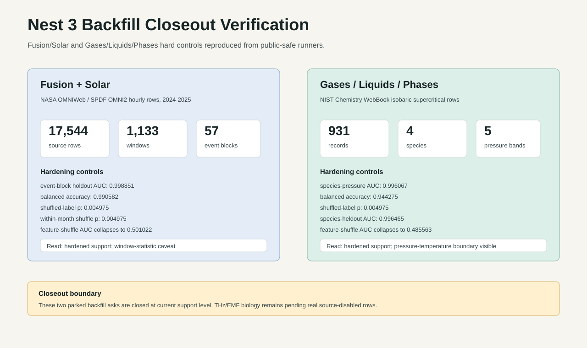

# Nest 3 Backfill Closeout Verification

Date: `2026-07-14`

Status: `fusion_solar_and_phase_backfill_reproduced`

Visual:



## Purpose

This note verifies the parked Nest 3 backfill loop:

1. `Fusion + Solar` needed named storm/event-block holdouts and seasonal/null
   controls.
2. `Gases / Liquids / Phases` needed supercritical/isobaric rows and
   pressure/species holdouts.

Both gates were rerun from the existing public-safe runners. No toy data,
synthetic rows, or placeholder evidence was added.

## Fusion + Solar Verification

Source:

- `NASA OMNIWeb / SPDF OMNI2 hourly data`
- Local source files: `omni2_2024.dat`, `omni2_2025.dat`
- Source rows: `17,544`

Gate:

- target: 12-hour windows with max `Kp >= 5`
- control: 12-hour windows with max `Kp <= 2`
- hard controls: storm/event-block holdout, same-active-month subset,
  within-month label shuffle, calendar/season-only null, feature shuffle

Rerun results:

| Metric | Value |
| --- | ---: |
| Used windows | `1,133` |
| Target / control windows | `249 / 884` |
| Event blocks | `57` |
| Feature count | `324` |
| Event-block AUC | `0.998851` |
| Event-block balanced accuracy | `0.990582` |
| Event-block shuffled-label p | `0.004975` |
| Event-block within-month shuffle p | `0.004975` |
| Event-block feature-shuffle AUC | `0.501022` |
| Same-active-month AUC | `0.998667` |
| Same-active-month balanced accuracy | `0.990561` |
| Same-active-month feature-shuffle AUC | `0.502326` |
| Calendar/season-only AUC | `0.630742` |

Read:

```text
hardened support; window-statistic caveat
```

Plain English: the solar-plasma lane survives the requested hard controls.
The model is not just reading calendar season, and feature shuffling collapses
toward chance. The boundary remains that this is a window-statistic support
row, not raw phase-order proof or full solar-cycle closeout.

## Gases / Liquids / Phases Verification

Source:

- `NIST Chemistry WebBook Thermophysical Properties of Fluid Systems`
- DOI / SRD reference: `https://doi.org/10.18434/T4D303`
- Isobaric tables for water, carbon dioxide, methane, and nitrogen
- Pressure bands: `0.40Pc`, `0.75Pc`, `1.10Pc`, `1.50Pc`, `2.00Pc`

Gate:

- target: NIST rows whose `Phase` column is `supercritical`
- control: NIST rows whose `Phase` column is `liquid` or `vapor`
- hard controls: species-pressure holdout, species holdout,
  no-temperature/pressure control, temperature/pressure-only control, feature
  shuffle

Rerun results:

| Metric | Value |
| --- | ---: |
| Records | `931` |
| Target / control records | `276 / 655` |
| Species | `4` |
| Pressure bands | `5` |
| Source tables | `20` |
| Feature count | `15` |
| Species-pressure AUC | `0.996067` |
| Species-pressure balanced accuracy | `0.944275` |
| Species-pressure shuffled-label p | `0.004975` |
| Species-pressure feature-shuffle AUC | `0.485563` |
| Species-heldout AUC | `0.996465` |
| No-temperature/pressure AUC | `0.949132` |
| Temperature/pressure-only AUC | `0.941515` |

Read:

```text
hardened support; pressure-temperature boundary visible
```

Plain English: the phase lane now has the requested real NIST isobaric /
supercritical hardening. The obvious pressure-temperature boundary carries
signal, as expected for supercritical phase, but the no-temperature/pressure
control keeps a property-vector signal visible separately from that boundary.

## Closeout State

These two parked backfill asks are now closed at the current support level:

- `Fusion + Solar`: storm/event-block and seasonal/null hardening reproduced.
- `Gases / Liquids / Phases`: supercritical/isobaric and species/pressure
  hardening reproduced.

Remaining Nest 3 boundaries are now clearer:

- `THz / EMF Biology`: protocol and partner packet are ready, but real
  source-on/source-off/source-disabled rows are still pending.
- `Fusion + Solar`: optional next extension is a longer solar-cycle span or
  NASA POWER solar-radiation comparator.
- `Gases / Liquids / Phases`: optional next extension is isochoric/two-phase
  dome rows or a second thermodynamic source family.

## Files

- Fusion runner:
  `experiments/nest3_fusion_solar_omniweb/run_omniweb_solar_plasma_hardening_gate.py`
- Fusion result:
  `experiments/nest3_fusion_solar_omniweb/results/nest3_fusion_solar_omniweb_hardening_2026-05-26.json`
- Fusion read:
  `docs/NEST3_FUSION_SOLAR_OMNIWEB_HARDENING_READ_2026-05-26.md`
- Phase runner:
  `experiments/nest3_gases_liquids_phases_nist/run_nist_isobaric_supercritical_gate.py`
- Phase result:
  `experiments/nest3_gases_liquids_phases_nist/results/nest3_gases_liquids_phases_nist_isobaric_supercritical_2026-05-26.json`
- Phase read:
  `docs/NEST3_GASES_LIQUIDS_PHASES_NIST_HARDENING_READ_2026-05-26.md`
