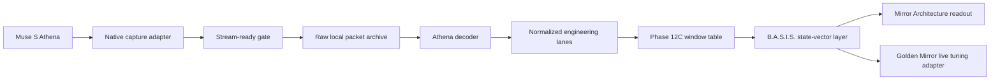
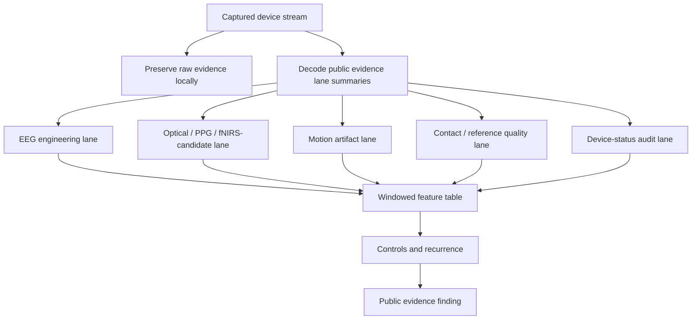
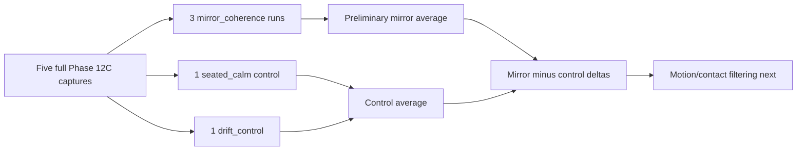
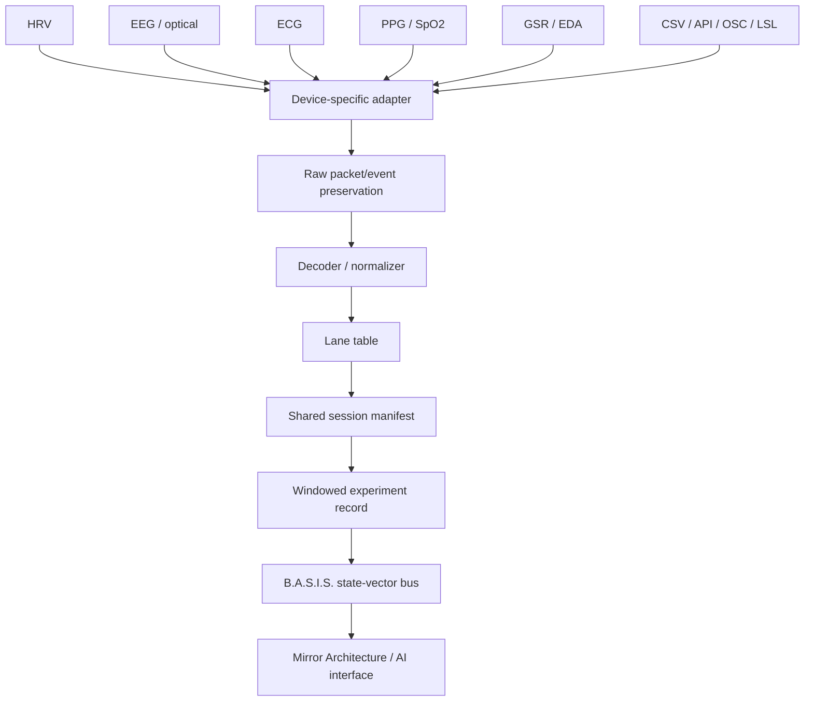

# Phase 12C B.A.S.I.S. Capture Hub Visual Map

Date: `2026-05-09`

Status: `public evidence visual map / docs-first release / patent-gated code release`

## Capture-To-Readout Map



## What The Adapter Separates



## Phase 12C Window Discipline

```mermaid
gantt
    title Phase 12C Window Timing
    dateFormat  X
    axisFormat %s
    section Session
    Baseline :0, 60
    Condition :60, 120
    Post :180, 60
```



Every sample is interpreted through this window map:

```text
sample timestamp
-> session manifest
-> baseline / condition / post label
-> condition class
-> lane-specific feature table
-> control-aware readout
```

## Five-Run Capture Pack



## What We Found

The five-run pack shows:

- stable capture density across all runs,
- decoded engineering lanes across every baseline / condition / post session,
- preliminary mirror-vs-control differences in optical, quality, and selected
  EEG channels,
- motion/contact lanes available for filtering and replication.

The public evidence interpretation is:

```text
Phase 12C has moved from protocol design into real windowed Muse S Athena
capture. The B.A.S.I.S. Capture Hub pathway works as an adapter pattern, and
the first five-run pack provides preliminary signal structure for controlled
follow-up.
```

## Capture Hub Pattern



The release discipline:

`evidence and public logging first, raw code and raw biosignal data private
through patent completion, selected public code later after review.`
