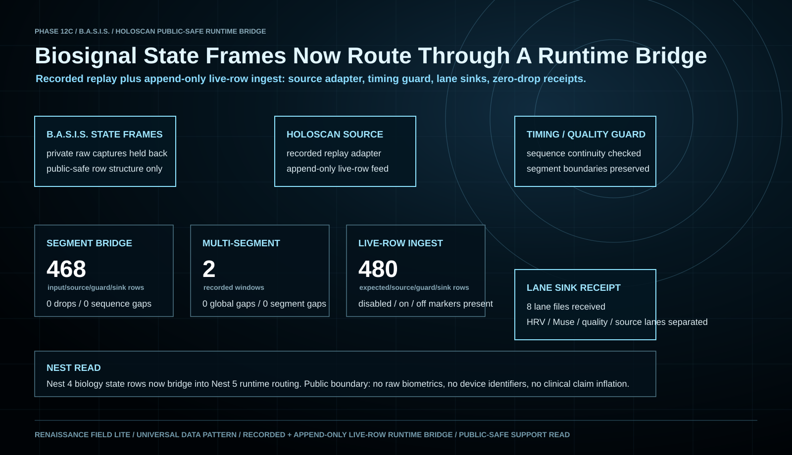

# Phase 12C B.A.S.I.S. Holoscan Public-Safe Bridge Read

Date: `2026-07-16`

Status: `public_safe_support_read / Holoscan_bridge_support_bearing / no_raw_biometrics`

Visual:



## Purpose

This note seats the B.A.S.I.S. Holoscan work as a public-safe runtime bridge
inside the Universal Data Pattern evidence stack. It reports only aggregate
engineering counts, lane behavior, runtime status, and boundary language.

It does not publish raw biometric exports, local capture paths, device
identifiers, private runtime credentials, or claim-sensitive mechanics.

## Plain-English Read

B.A.S.I.S. has now moved beyond static capture inventory. Recorded Phase 12C
state-frame rows can be routed through Holoscan source / guard / sink runtime
paths and received as lane-separated output without packet loss or sequence
gaps in the closed public-safe gates.

That matters because it converts the biosignal lane from:

```text
private capture exists
```

into:

```text
private capture -> public-safe state frames -> runtime source adapter
-> timing / quality guard -> lane sink receipt
```

The support claim is not clinical. The support claim is architectural and
engineering-level: the same B.A.S.I.S. state-frame structure can be routed
through a medical-device-oriented streaming runtime pattern while preserving
condition windows, lane names, sequence continuity, and public/private
boundaries.

## Closed Runtime Gates

| Gate | Public-safe result | Boundary |
| --- | --- | --- |
| Holoscan runtime availability | local GPU workstation ran the Holoscan Python SDK path | workstation details remain operational, not proof claims |
| Recorded segment bridge | `468` input/source/guard/sink rows replayed from one public-safe state-frame pack | recorded replay, not live clinical deployment |
| Lane sink receipt | `7` lane sink files received | no raw biometric payloads published |
| Timing / quality guard | `0` drops and `0` sequence gaps in the closed segment gate | guard is engineering QA, not medical-device certification |
| Multi-segment bridge | `468` rows across `2` recorded windows; `0` global gaps and `0` segment gaps | validates segment boundary handling, not population-scale performance |
| Append-only live-row ingest bridge | `480` expected/source/guard/sink rows, `0` drops, `0` sequence gaps, source-disabled/on/off markers present, `8` lane sinks written | live-row software ingest over real state-frame rows, not direct live sensor capture |

## What The Gate Shows

1. **B.A.S.I.S. state frames are routable.** The capture rows can be converted
   into bounded state-frame events and passed through replay, segment, and
   append-only live-row streaming runtime patterns.
2. **Lane separation is preserved.** HRV, Muse-derived, quality, motion, and
   related lanes can be kept as named sink outputs instead of flattened into one
   opaque blob.
3. **Timing continuity can be checked.** The gate records sequence continuity,
   segment boundaries, and sink receipt, which is the practical bridge from
   biosignal capture into reviewable runtime infrastructure.
4. **Public release can stay safe.** The public evidence card can show the
   runtime proof without publishing biometric rows, device identifiers, or
   private capture paths.

## Why This Belongs In The Universal Data Pattern Arc

The Universal Data Pattern is not only a dataset pattern. It is a repeatable
state/control relationship that can move across substrates when the route is
measured and bounded.

B.A.S.I.S. is the living-signal adapter. Holoscan is the runtime bridge. The
closed gate shows that a biosignal state surface can become a streamable,
quality-guarded, lane-separated runtime object. That is the same larger arc
seen elsewhere in the repository:

```text
source signal
-> structured state/control row
-> quality or null boundary
-> transform / routing surface
-> support read
-> next gate
```

In Nest terms, this sits at the boundary between:

- `Nest 4`: biology / physiology / biosignal state rows; and
- `Nest 5`: product runtime, medical-device workflow, evidence memory, and AI
  partner routing.

## What This Does Not Claim

This note does not claim diagnosis, treatment, clinical validation, medical
device clearance, patient monitoring readiness, final EEG interpretation,
population-level generalization, or live hospital deployment.

It also does not claim true same-clock HRV + Muse + Thermo closure. The Thermo
lane remains a sidecar / continuation lane until a repeatable same-clock triple
capture closes.

## Current Boundary

The current support-bearing runtime claim is:

```text
recorded B.A.S.I.S. state frames can pass through Holoscan replay,
multi-segment, and append-only live-row source paths with timing/quality guard
checks, lane-separated sink receipts, source-control markers, and sequence
continuity preserved.
```

The stronger future claim requires:

```text
direct live B.A.S.I.S. device capture
-> same-clock HRV + Muse + optional temperature sidecar
-> Holoscan source adapter
-> timing / quality guard
-> lane sink receipt
-> public-safe aggregate read
```

## Next Gate

The append-only live-row Holoscan bridge is now closed. The next clean gate is
the direct live-device version:

```text
direct live Muse / MoFit / optional Withings rows
-> reset / power-state preflight
-> source-disabled baseline
-> source-on / source-off markers
-> Holoscan source adapter
-> timing / quality guard
-> lane sink receipt
-> synchronized public-safe manifest
```

The Thermo continuation should stay explicitly separate:

```text
temperature sidecar
-> same-session clock check
-> true HRV + Muse + temperature triple
-> public-safe aggregate read
```

Until that closes, HRV + Muse remains the support-bearing biosignal bridge, and
temperature remains auxiliary.
