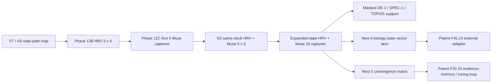
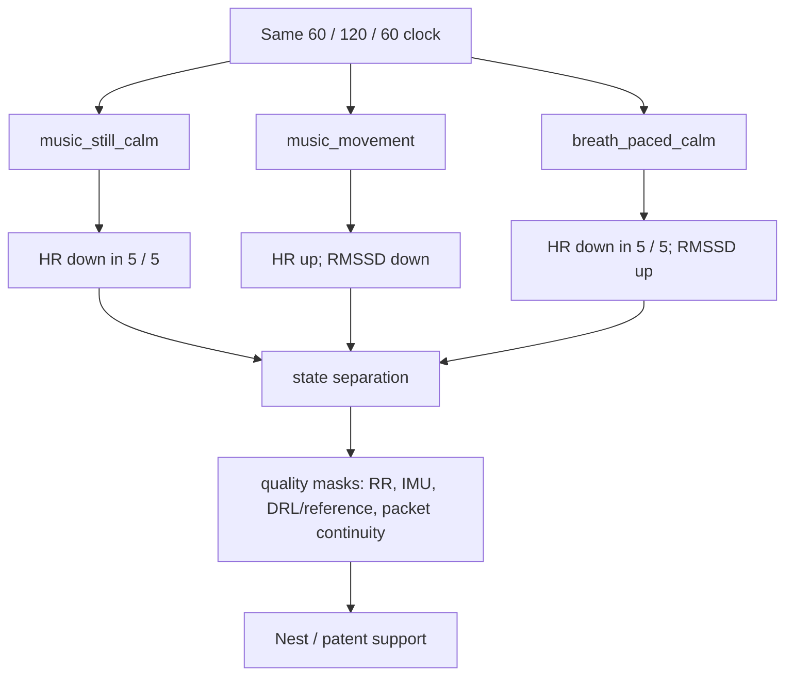
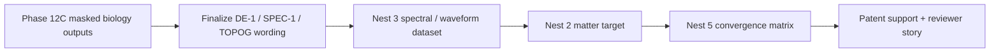

# Phase 12C Capture Storyline And Visual Readout

Date: `2026-05-15`

Status: `public_safe_storyline / aggregate_only / raw_private`

## The Plain Story

Phase 12C is not just "we captured Muse data."

Phase 12C tested whether the Universal Data Pattern state-variable stack,
first mapped in transformer / Mirror Architecture work, can be expressed in a
real biological substrate with actual sensors, repeated state windows, controls,
drift variables, and quality masks.

The first five Muse captures showed that the variables could be mapped in Muse
S Athena lanes. The N2 `5 x 3` same-clock pack showed those variables could
travel with HRV and Muse in the same operator clock. The expanded-state `15`
captures tested whether the same map still separates when the state families
change from mirror/calm/drift into music stillness, movement, and paced breath.

## Visual Spine



## What The First Five Showed

The first five Muse S Athena captures were the proof-of-capture and
proof-of-mapping event:

| Surface | What it showed |
| --- | --- |
| `state` | three mirror-coherence target runs could be captured as named biological state rows |
| `control` | seated-calm control and drift-control comparator could be captured in the same lane schema |
| `transform` | Muse packet traffic could be decoded into EEG, optical candidate, IMU, DRL/reference, battery/status, and state/control/drift/alignment readouts |
| `artifact / quality` | motion and reference quality were not afterthoughts; they traveled with the signal |
| `support` | Muse was not just a device connection; it became a real B.A.S.I.S. / Nest 4 adapter surface |

Read:

```text
The first five captures showed the Universal Data Pattern variables could be
mapped in a richer biological substrate than HRV alone.
```

## What The N2 Fifteen Showed

N2 produced a `5 x 3` same-clock HRV + Muse matrix:

| Condition | Rows | Role | Mean HR | RMSSD | SDNN |
| --- | ---: | --- | ---: | ---: | ---: |
| `mirror_coherence` | `5 / 5` | target state | `59.761` | `63.392` | `98.028` |
| `seated_calm` | `5 / 5` | low-activation control | `60.296` | `54.928` | `96.167` |
| `drift_control` | `5 / 5` | drift comparator | `64.004` | `46.893` | `88.510` |

Main separation:

| Comparison | HR delta | RMSSD delta | SDNN delta |
| --- | ---: | ---: | ---: |
| `mirror_coherence - drift_control` | `-4.243` | `+16.499` | `+9.518` |
| `drift_control - seated_calm` | `+3.707` | `-8.036` | `-7.657` |

Read:

```text
N2 showed that the mirror/calm/drift structure still separates when HRV and
Muse are captured in the same state windows. Drift was more activated on HRV;
mirror and calm were lower-HR / higher-HRV relative to drift. EEG became a real
candidate feature surface, but HRV carried the strongest first-order read.
```

## What The Expanded Fifteen Showed

The expanded-state captures added three new state families, five valid repeats
each:

| State family | Rows | Condition read |
| --- | ---: | --- |
| `music_still_calm` | `5 / 5` | condition HR below baseline in `5 / 5`; mean HR delta `-5.267 bpm` |
| `music_movement` | `5 / 5` | condition HR rose on average; mean HR delta `+5.197 bpm`; mean RMSSD delta `-6.112 ms` |
| `breath_paced_calm` | `5 / 5` | condition HR below baseline in `5 / 5`; mean HR delta `-3.732 bpm`; mean RMSSD delta `+4.038 ms` |

Visual read:



Read:

```text
The expanded fifteen showed that state is not just a label. When the administered
state changes, the biological response changes in the expected direction:
stillness and breath regulation settle HR; movement activates HR and reduces
RMSSD. The same window clock, packet gate, device lanes, artifact masks, and
quality variables stayed attached.
```

## Universal Data Pattern Readout

| Universal Data Pattern variable | Phase 12C evidence |
| --- | --- |
| `state` | named rows: mirror coherence, seated calm, drift control, music stillness, movement, paced breath |
| `control` | seated calm, drift control, baseline windows, still-vs-movement contrast |
| `transform` | Muse packets + HRV streams converted into aligned state windows and decoded feature lanes |
| `invariant` | same clock discipline, same baseline/condition/post structure, same packet gate |
| `drift` | drift_control, movement, recovery drift, motion, reference/contact changes, RR instability |
| `artifact / quality` | IMU, DRL/reference, packet density, RR artifact review, failed-preflight exclusions |
| `recurrence` | five valid repeats per promoted condition family |
| `separation` | mirror/calm/drift separation in N2; still/movement/breath separation in expanded states |
| `support` | real biological state-vector surface for Nest 1, Nest 4, Nest 5, FIG.14, and FIG.15 |

## What This Means

The result is not a single magic score. The support comes from the full state
path:

```text
administered state
-> same-clock capture
-> decoded lanes
-> quality masks
-> repeated rows
-> state/control/drift separation
-> Nest support
-> patent support
```

That is the storyline:

1. `Phase 12B` proved HRV can carry coarse biological condition separation.
2. The first `Phase 12C` five-run Muse pack proved Muse can carry the richer
   biology lane map.
3. `N2` proved HRV + Muse can run together in the same clock across
   mirror/calm/drift.
4. The expanded `15` proved the lane does not collapse when new state families
   are introduced.
5. The next non-biology Nest work should test whether the same state/control /
   transform / drift / quality / recurrence discipline holds in spectral,
   water, electrochemical, or second materials datasets.

## Boundary

This is not a clinical claim and not a final EEG brain-state claim.

Current claim level:

```text
Phase 12C supports the Universal Data Pattern as a real biological
state-vector adapter: repeated same-clock HRV + Muse rows preserve named state,
control, drift, transform, artifact/quality, recurrence, and separation
structure across mirror/calm/drift and expanded music/movement/breath
conditions.
```

EEG is real measured candidate support for `DE-1`, `SPEC-1`, and `TOPOG`; it
stays artifact-masked until channel quality, motion, and reference behavior are
tighter.

## What To Show Reviewers

Use this order:

1. Show the first five Muse captures as the bridge from HRV-only to multimodal
   biology.
2. Show the N2 `5 x 3` same-clock matrix as the state/control/drift proof.
3. Show the expanded `15` as the state-generalization proof.
4. Show the masks and exclusions so the work stays evidence disciplined.
5. Show the Nest plug-in: Nest 1 formal return, Nest 4 biology, Nest 5
   convergence, FIG.14 external adapter, FIG.15 live evidence-memory loop.

## Coherent Arc For The Next Gates

The next work should not be presented as four disconnected chores. It is one
arc:



### Gate 1: Nest 1 Formal Return

Finalize `DE-1`, `SPEC-1`, and `TOPOG` from the masked Phase 12C outputs.

Purpose:

```text
biology capture -> formal dynamics / spectral / topographic language
```

This says the Muse + HRV work is not just a device result. It returns into the
formal Mirror Architecture lanes.

### Gate 2: Nest 3 Physical Waveform / Spectral Row

Run or source one real physical spectral / waveform dataset.

Purpose:

```text
biology waveform bridge -> physical waveform / spectral substrate
```

The best next target is `Nest 3 spectral signatures` because it also activates
the Nest 2 spectral-signature row.

### Gate 3: Nest 2 Matter Target

Run or source one real matter target:

- `Spectral Signatures`
- `H2O`
- `Electrochemistry`
- second `Materials / Semiconductors`

Purpose:

```text
physical waveform / spectra -> structured matter adapter
```

This prevents Phase 12C from carrying more than it should. Biology supports the
response adapter; a real matter dataset supports the matter row.

### Gate 4: Nest 5 Convergence

Build the convergence matrix from supported Nest 1-4 rows.

Purpose:

```text
formal + matter + waveform + biology -> convergence support matrix
```

This is where the story becomes reviewer-readable: the Universal Data Pattern is
not asserted from one lane. It is tracked as the same state/control/transform /
drift / quality / recurrence / separation structure recurring across supported
substrates.

## One-Sentence Arc

```text
Phase 12C turns the HRV-only biology lane into a repeated, same-clock
neural/autonomic state-vector surface; the remaining work is to carry that
surface back into formal Nest 1 wording, out into one real Nest 3 physical
waveform/spectral substrate, down into one real Nest 2 matter target, and then
up into a Nest 5 convergence matrix.
```
