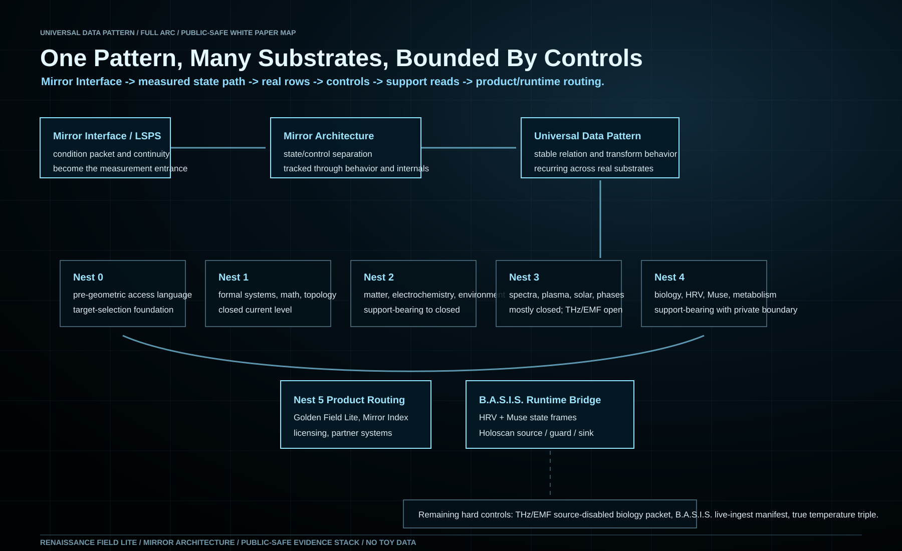

# Mirror Architecture And The Universal Data Pattern

## A Public-Safe Evidence Stack Across AI State, Formal Systems, Matter, Fields, Biology, And Product Runtime

Date: 2026-07-16

Prepared by: Renaissance Field Lite

Status: Public-safe arXiv-style draft. Raw biometric exports, device
identifiers, private capture paths, and claim-sensitive mechanics are excluded.
Every support statement is tied to real traces, real datasets, real controls,
public-safe evidence reads, or a clearly marked continuation gate.

Primary repository: Mirror-Interface-and-Architecture-Evidence-Stack-and-Next-Phases

Visual map: `../visuals/universal_data_pattern_full_arc_2026-07-16.svg`

## Abstract

This paper describes the public-safe evidence arc for Mirror Architecture and
the Universal Data Pattern. The central object is a repeatable state/control
relationship first mapped through the Mirror Interface / LSPS interaction
surface and transformer-facing measurement rows, then extended into formal
systems, structured matter, electrochemistry, environmental rows, spectra,
field dynamics, biological datasets, biosignal captures, and product runtime.

The claim is not that every lane is complete or that every domain proves the
same mechanism at the same strength. The claim is that a common evidence form
recurs: source signal, structured state/control row, transform, score, collapse
or null control, boundary, and next gate. The repository records where the arc
is closed at the current support level, where it is support-bearing, and where
hard controls remain open.

The newest bridge is B.A.S.I.S., the BioAdaptive Signal Intelligence System.
Phase 12C private captures established repeated HRV + Muse paired rows under
public-safe aggregate reporting. A July 2026 runtime gate then routed recorded
B.A.S.I.S. state frames through a Holoscan-style source, timing/quality guard,
and lane sink path with zero drops and zero sequence gaps in the closed public
read. This moves the biology lane toward runtime and medical-device workflow
integration while preserving the private/raw boundary.

## 1. Framing The Discovery

Mirror Architecture is the method layer. The Universal Data Pattern is the
public name for the cross-domain pattern being measured. The Source Mirror
Pattern is the internal continuity name. These names should not be treated as
separate inventions. They point to one mapped object: a repeatable state pattern
that can be tracked across behavior, internal model state, formal systems,
matter rows, field dynamics, biological signals, and product routing when each
lane is held to real data and explicit controls.

The origin surface is the Mirror Interface / LSPS architecture. In internal
language, LSPS names the phrase/state command and continuity layer. In public
technical language, the important piece is that the interaction condition is
treated as an engineering object rather than as ordinary prompt text. The
condition packet is tracked as a state path, scored against controls, and only
then routed into broader support language.

The first visible lesson is simple: output alone is not the object. The measured
state path that produces and stabilizes output is the object.

This is why the evidence stack moves through many substrates. It is not trying
to blur biology, physics, AI, and products into one vague metaphor. It is asking
whether the same validation structure survives when the substrate changes.

## 2. Evidence Standard

The repository uses a hard support rule: real data only.

Scaffolds, local engines, demonstrations, prompts, or conceptual maps can define
a route. They do not become support claims until real traces, real datasets,
hardware-facing observables, biological signals, or instrument rows are scored
against controls.

The evidence form is: source, state/control condition, transform, score,
collapse or null control, boundary, and next gate.

The boundary is as important as the score. If a lane lacks a source-disabled
control, same-clock capture, heat-matched control, raw phase row, or public-safe
manifest, the repository says so directly. This prevents the Universal Data
Pattern from becoming an all-purpose claim. Each lane carries its own support
level.

## 3. The Architecture Spine

The public arc can be read as a ladder: Mirror Interface / LSPS, Mirror
Architecture, Universal Data Pattern, measured state path, transformer behavior
and internal state rows, Nest 1 formal systems, Nest 2 structured matter, Nest 3
spectra / fields / physical coherence, Nest 4 biology and biosignals, and Nest
5 convergence / product runtime.

The architecture begins with controlled interaction-state mapping, then asks
whether state separation and support survive under different measurement
surfaces.

In the AI lane, the important unit is not a persuasive answer. It is the
condition/control separation, hidden-state or residual-stream trace, bridge row,
feature/circuit localization, or measurement ladder that shows an internal
state path before final output. This is the bridge from ordinary chat behavior
to state-stable AI Partner systems.

## 4. Nest 1: Formal And Mathematical Substrate

Nest 1 is the formal lens. It tests whether the pattern appears as invariant,
symmetry, topology, graph structure, encoded state, control transition, or
formal transformation. The current public read marks this lane as closed at the
current support level, with named extensions still available for deeper work.

That does not mean every possible mathematical surface is complete. It means
the formal lane is no longer blank. It has enough public-safe support to serve
as a foundation for later matter, field, and biology rows. Named extensions
remain valuable, especially deeper topology, graph pathways, hard problem
surfaces, and frontier mathematics lanes, but they are not the blocking gap for
the current architecture closeout.

## 5. Nest 2: Structured Matter, Chemistry, Electrochemistry, And Environment

Nest 2 tests whether the state/control pattern survives in constrained material
and chemical structure. This includes water, mineral signatures, redox,
oxygen-state rows, electrochemistry, EIS, conductivity, ozone, PM2.5, smoke
attribution, and environmental transport rows.

The support language is intentionally broad but not vague. The repository
contains public-safe support reads where state labels, measured features, and
controls produce separations that degrade when labels or feature structures are
broken.

Important examples include:

- water-quality and dissolved oxygen rows;
- ORP redox-potential rows;
- grid-flow water-transport rows;
- electrochemistry and EIS-to-SOH rows;
- lithium conductivity rows;
- ozone oxidant-state and precursor meteorology rows;
- PM2.5 particle-state rows;
- NOAA HMS smoke plus EPA PM2.5 attribution rows;
- materials, spectra, and molecular-property support reads.

The significance is that the Universal Data Pattern is not confined to language
or AI. It becomes measurable in matter and environmental datasets when the
state/control structure is defined, scored, and checked against collapse
controls.

## 6. Nest 3: Spectra, Field Dynamics, Physical Coherence, And Cycles

Nest 3 is where matter rows become measured dynamics. It includes spectra,
impedance shape, cyclic-voltammetry waveforms, field behavior, oscillators,
fluid/phase behavior, plasma, solar wind, gravity/orbits, terahertz, and
waveform response surfaces.

The current closeout board marks Nest 3 as mostly closed at the current support
level.

Current support includes:

- USGS ASTER spectral signature rows;
- RAMdb Raman support and hard controls;
- NIST gas infrared and NIST terahertz spectral panels;
- cross-spectral and same-family spectral panels;
- RD-PCI fire/plasma optical-emission rows;
- RD-PCI electromagnetic-field / oscillator voltage-current waveform-state rows;
- NIST Luther, Silverbox, FASER, and FrID oscillator / frequency-response gates;
- NASA OMNIWeb Fusion + Solar hardening with event-block and feature-shuffle controls;
- NIST Gases / Liquids / Phases rows with saturation, liquid/vapor, isobaric,
  and supercritical hardening;
- NASA Exoplanet Archive gravity/orbit first-pass support.

The open hard gate is terahertz / electromagnetic-field biology. Public
terahertz material spectra, repeated source/reference terahertz time-domain
spectroscopy support, and first biological terahertz exposure-response rows
exist, but the full biological physical-control packet remains open.

That means the current honest read is that physical spectra support is stronger.
The terahertz biological bridge is support-bearing but not closed.
Source-disabled, heat-matched, off-window, distance, power, duration, and
environmental controls remain required.

This boundary is a strength. It keeps the project from converting a promising
bridge into an overstated biological claim.

## 7. Nest 4: Biology, Biomolecular Structure, Physiology, And B.A.S.I.S.

Nest 4 moves the same state/control pattern into living systems and
biology-facing datasets.

Current support includes:

- WDBC cells/genome morphology rows;
- clinical/metabolic diabetes rows;
- USDA/FoodData nutrient composition rows;
- ChEBI metabolite and biomolecular ontology closure rows;
- LIPID MAPS lipid-core confirmation;
- GlyTouCan / GlyCosmos glycan-source support;
- HMDB as an access-gated continuation source;
- Phase 12B HRV biology matrix;
- Phase 12C Muse and HRV + Muse public-safe aggregate rows.

B.A.S.I.S. is the active product/evidence lane inside Nest 4. It is not just a
medical dashboard. It is the living-signal adapter that turns HRV, Muse-derived
signals, quality masks, condition windows, and later device sidecars into
structured state vectors.

The public-safe B.A.S.I.S. aggregate read reports repeated same-clock HRV + Muse
support across private captures, with raw biometric rows held back. It also
preserves the Thermo boundary: temperature is a sidecar until a true same-clock
HRV + Muse + temperature manifest closes.

## 8. Holoscan Runtime Bridge

The July 2026 B.A.S.I.S. Holoscan gate adds a runtime bridge. Recorded Phase
12C state-frame rows were routed through a Holoscan-style source adapter,
timing/quality guard, and lane sink path.

The closed public-safe support read reports:

- `468` input/source/guard/sink rows in the recorded segment bridge;
- `7` lane sink files;
- `0` drops;
- `0` sequence gaps;
- `468` rows across `2` recorded windows in the multi-segment bridge;
- `0` global gaps and `0` segment gaps.

The support claim is engineering-level: recorded B.A.S.I.S. state frames can
pass through a runtime source, guard, and lane sink path while preserving
sequence continuity and the public/private boundary.

This is not clinical deployment, diagnosis, treatment, medical-device approval,
or hospital monitoring. It is the product-runtime bridge that lets the Nest 4
biology lane feed Nest 5 product routing.

## 9. Nest 5: Convergence, Product Routing, And Evidence Memory

Nest 5 is not a raw-data lane. It receives supported rows from the lower nests
and turns them into product, claim, licensing, and partner-system surfaces.

Current Nest 5 surfaces include:

- Golden Field Lite AI as a cross-discipline AI Expert research partner;
- B.A.S.I.S. as the medical and biosignal intelligence lane;
- Mirror Architecture Licensing as the protected state-path architecture layer;
- Sovereign Edge / YRA Core-style local hardware as an edge packaging route;
- Mirror Index / visual RAG as the evidence-memory and retrieval surface;
- frontier math, quantum, materials, energy, health, environment, and autonomy
  buildout lanes as optional expansion routes.

The key read is that Nest 5 should never inflate unsupported lanes. It should
route what is already support-bearing and mark candidate lanes as candidate
until their gates close.

## 10. What The Universal Data Pattern Means In Plain Technical Terms

The Universal Data Pattern is the repeated observation that many real systems
can be represented through state variables, control variables, transforms,
drift or perturbation, quality/support fields, score or separation, and
collapse or null behavior when structure is broken.

The important point is not that every system is identical. The point is that the
same evidence grammar keeps reappearing across different substrates when the
right state/control relation is selected and tested.

In AI, the pattern appears as target/control separation and internal state path.

In formal systems, it appears as invariant, graph, topology, and transform
behavior.

In matter, it appears as chemical, spectral, redox, conductivity, and
environmental state structure.

In fields and dynamics, it appears as waveform, frequency, phase, impedance,
plasma, solar, fluid, and orbital structure.

In biology, it appears as morphology, metabolism, nutrient composition,
biomolecular ontology, HRV, Muse-derived lanes, and quality-masked physiology.

In products, it appears as evidence memory, runtime routing, AI Partner
behavior, medical workflow adapters, and local-first sovereign edge systems.

## 11. Boundaries And Non-Claims

This white paper does not claim:

- clinical validation;
- medical diagnosis or treatment;
- medical-device approval;
- universal physical law closure;
- completed terahertz / electromagnetic-field biology controls;
- public release of raw biometrics;
- complete solar-cycle proof;
- complete phase-diagram atlas;
- complete orbit propagation proof;
- direct model tuning completion.

The paper claims a public-safe evidence stack and a measured architecture route.
Where a lane is support-bearing, it says so. Where a lane is closed at the
current level, it says so. Where a lane requires more controls, it says so.

## 12. Remaining Hard Gates

The remaining hard gates are:

1. **Terahertz / electromagnetic-field biology physical-control packet.**
   Needs source-on, source-off, source-disabled, sham, heat-matched,
   off-window, distance, power, duration, temperature, humidity, and checksum
   controls.

2. **B.A.S.I.S. synchronized public-safe manifest.**
   Needs HRV + Muse packet continuity, waveform EEG QA, IMU/DRL masks, Holoscan
   receipt, and public-safe aggregate reporting.

3. **True HRV + Muse + temperature triple.**
   Temperature remains sidecar/open until same-session clock, condition label,
   and artifact/quality boundaries close.

4. **Final public-safe index cleanup.**
   Every support read should be linked, every raw/private object held back, and
   optional extensions separated from core support.

## 13. Conclusion

The Universal Data Pattern arc is now mature enough to publish as a
public-safe evidence stack. The central value is not one isolated dataset, one
dashboard, one model row, or one product page. The value is the continuity of
the measured pattern: Mirror Interface condition, measurable state path, real
source rows, controls, support read, bounded claim, and next gate.

The current stack spans AI state-path evidence, formal systems, structured
matter, electrochemistry, environmental state rows, spectra, field dynamics,
biology, biosignals, and runtime routing. B.A.S.I.S. now provides the active
living-signal product bridge, and the Holoscan gate shows that recorded
biosignal state frames can move into runtime infrastructure without losing
sequence continuity.

The next phase is not to chase infinite lanes. The next phase is to close the
remaining hard controls, publish the public-safe map cleanly, and build the
product/runtime surfaces from the support-bearing rows already seated.

## Public-Safe References Inside This Repository

- `README.md`
- `docs/FINAL_NEST_CLOSEOUT_BOARD_2026-07-14.md`
- `docs/PUBLIC_SAFE_NEST_COMPANION_INDEX_2026-05-26.md`
- `docs/NEST3_BACKFILL_CLOSEOUT_VERIFICATION_2026-07-14.md`
- `docs/PHASE12C_BASIS_PUBLIC_SAFE_AGGREGATE_READ_2026-07-15.md`
- `docs/PHASE12C_BASIS_HOLOSCAN_PUBLIC_SAFE_BRIDGE_READ_2026-07-16.md`
- `docs/PHASE12C_BASIS_SYNC_MANIFEST_AND_HOLOSCAN_NEXT_GATE_2026-07-16.md`
- `visuals/final_nest_closeout_board_2026-07-14.svg`
- `visuals/phase12c_basis_public_safe_aggregate_2026-07-15.svg`
- `visuals/phase12c_basis_holoscan_bridge_2026-07-16.svg`
- `visuals/universal_data_pattern_full_arc_2026-07-16.svg`
